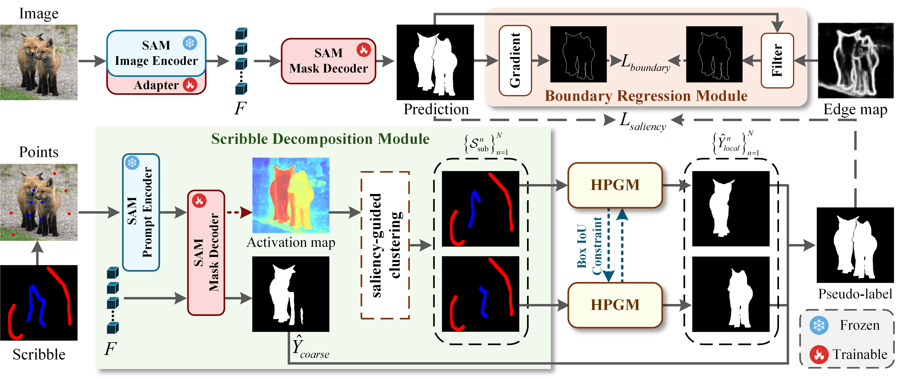

# Scribble-guided Hierarchical Prompt for SAM-Based Weakly Supervised Salient Object Detection

---

## Overview

## Datasets

<https://pan.baidu.com/s/1oFJmarUSuLI4hB5obEOtOw?pwd=assy> (fetch code: assy)

## Evaluation Code

we use the evaluation code below to generate results:

<https://github.com/lartpang/PySODMetrics>

Following [MDSAM](https://github.com/BellyBeauty/MDSAM), we modify the calculation method of the max F-measure from selecting a unified highest threshold for all images to calculating the highest threshold for each individual image.
